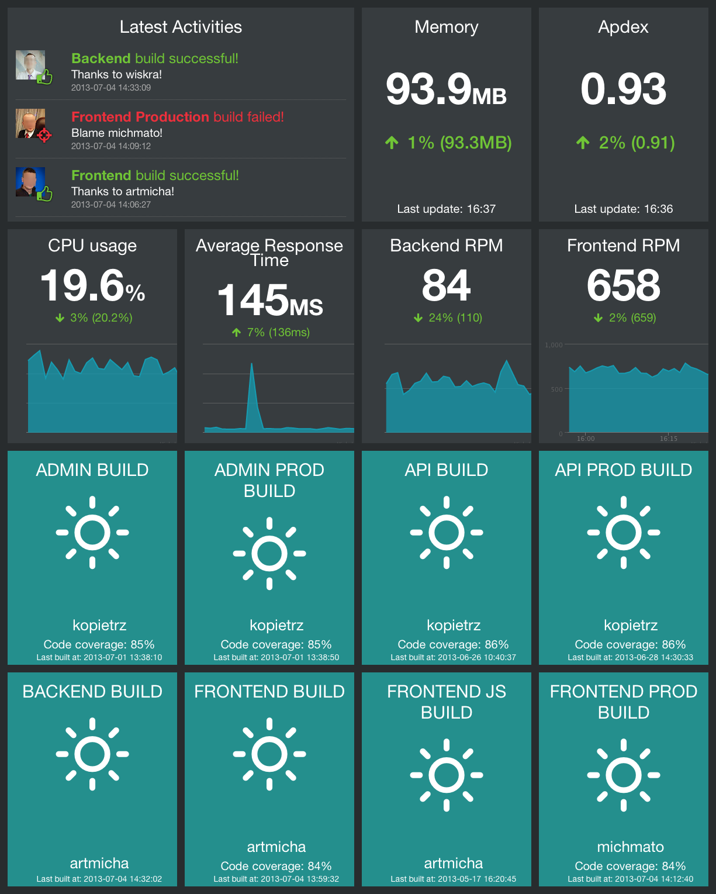

# Stp.Rtm

Real time monitor dashboard using Jenkins API and New Relic API

## Dependencies
- php >="5.3.3"
- cURL
- Zend Framework "2.2.0"
- Doctrine-mongo-odm-module
- MongoDB PHP driver
- [Whoops](https://github.com/filp/whoops) error handler
- MongoDB server (required only by Message widget)

## Installation

The recommended way to get a working copy of this project is to clone the repository
and use `composer` to install dependencies. If you want to install packages listed in
require-dev, skip "--no-dev" option.

    php composer.phar self-update
    php composer.phar install --no-dev

(The `self-update` directive is to ensure you have an up-to-date `composer.phar`
available.)

## Available types of widgets

- <strong>Number</strong> - Displays numeric value with percentage difference between current and previous value.
- <strong>Graph</strong> - Similar to Number widget but with additional graph displaying history of values.
- <strong>Message</strong> - Displays text messages that can be pushed to a database using REST API.
- <strong>Build</strong> - Displays current status of a build with additional info about build author and code coverage (if provided).
During a build process it shows progress bar. Widget relies on Jenkins REST API.
- <strong>Error</strong> - Similar to Number widget but with different behaviour when some errors appear.
- <strong>Alert</strong> - Shows urls that produced 500 status code (internal server error). Widget relies on Splunk REST API.

## Usage

### Defining configuration file

Here's an example of a configuration file which is required by the dashboard. Each dashboard renders widget

`
/**
 * Config for rtm
 */
return array(
    'newRelic' => array(
        'headers' => array(
            'x-api-key' => '%API_KEY%',
        ),
        'params' => array(
            'accountId' => '%ACCOUNT_ID%',
        ),
    ),
    'widgets' => array(
        array('id' => '%UNIQUE_TO_DASHBOARD_WIDGET_ID%',
            'type' => 'messages',
            'params' => array(
                'dao' => 'messages',
                'metric' => 'messages',
                'span' => '%WIDGET_WIDTH%', // widget width, accepted values: 1-12
                'title' => '%WIDGET_TITLE%', // string title
            ),
        ),
        array('id' => '%UNIQUE_TO_DASHBOARD_WIDGET_ID%',
            'type' => 'number',
            'params' => array(
                'dao' => '%DAO_TO_FETCH_DATA%',
                'metric' => '%METRIC_NAME_TO_PRESENT',
                'title' => '%WIDGET_TITLE%', // string title (optional)
                'subtitle' => '%WIDGET_SUBTITILE%', // string subtitle (optional)
                'span' => '%WIDGET_WIDTH%', // widget width, accepted values: 1-12 (optional)
                'valuePrefix' => '%VALUE_PREFIX%', // string value to be displayed in front of the value (optional)
                'valueSuffix' => '%VALUE_SUFFIX%', // string value to be displayed after the value (optional)
            ),
        ),
        array('id' => '%UNIQUE_TO_DASHBOARD_WIDGET_ID%',
            'type' => 'error',
            'params' => array(
                'dao' => 'newRelic',
                'metric' => 'errorRate',
                'appId' => '%NEW_RELIC_APP_ID%',
                'title' => '%WIDGET_TITLE%', // string title (optional)
                'subtitle' => '%WIDGET_SUBTITILE%', // string subtitle (optional)
                'span' => '%WIDGET_WIDTH%', // widget width, accepted values: 1-12 (optional)
                'valuePrefix' => '%VALUE_PREFIX%', // string value to be displayed in front of the value (optional)
                'valueSuffix' => '%', // string value to be displayed after the value (optional)
            ),
        ),

        array('id' => '%UNIQUE_TO_DASHBOARD_WIDGET_ID%',
            'type' => 'graph',
            'params' => array(
                'dao' => 'newRelic',
                'metric' => 'cpuUsage',
                'appId' => '%NEW_RELIC_APP_ID%',
                'title' => '%WIDGET_TITLE%', // string title (optional)
                'subtitle' => '%WIDGET_SUBTITILE%', // string subtitle (optional)
                'span' => '%WIDGET_WIDTH%', // widget width, accepted values: 1-12 (optional)
                'valuePrefix' => '%VALUE_PREFIX%', // string value to be displayed in front of the value (optional)
                'valueSuffix' => '%', // string value to be displayed after the value (optional)
                'beginDateTime' => date('Y-m-d', strtotime('-30 minutes')) . 'T' . date('H:i:s', strtotime('-30 minutes')) . 'Z', // start time for collecting data for the graph
                'endDateTime' => date('Y-m-d') . 'T' . date('H:i:s') . 'Z',  // end time for collecting data for the graph
            ),
        ),
        array('id' => '%UNIQUE_TO_DASHBOARD_WIDGET_ID%',
            'type' => 'build',
            'params' => array(
                'dao' => 'jenkins',
                'view' => '%VIEW_NAME%', // Jenkins view name (from URL)
                'job' => '%JOB_NAME%', // Jenkins job name (from URL)
                'metric' => 'status',
                'title' => '%WIDGET_TITLE%', // string title (optional)
                'subtitle' => '%WIDGET_SUBTITILE%', // string subtitle (optional)
                'span' => '%WIDGET_WIDTH%', // widget width, accepted values: 1-12 (optional)
                'valuePrefix' => '%VALUE_PREFIX%', // string value to be displayed in front of the value (optional)
                'valueSuffix' => '%', // string value to be displayed after the value (optional)
            ),
        ),
    ),
);
`

##License

Distributed under the MIT license
